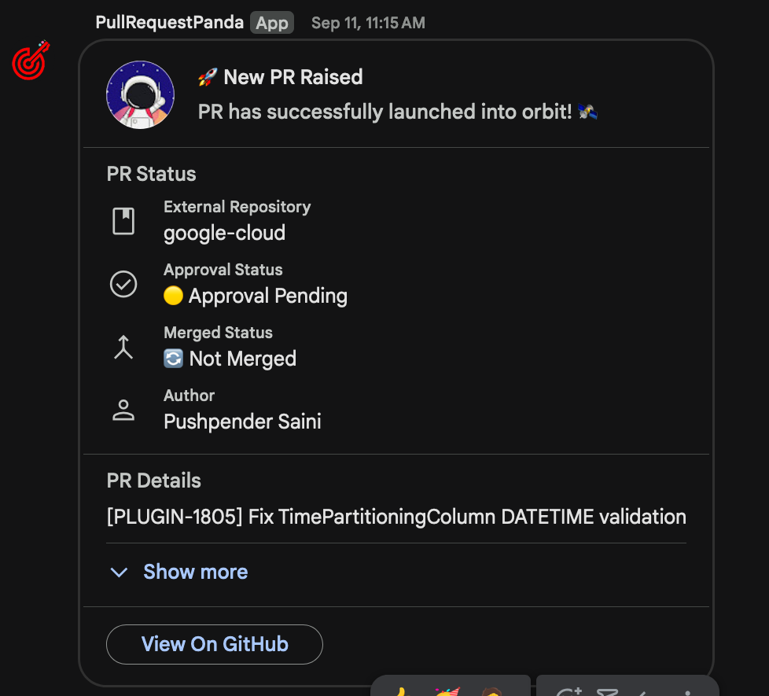
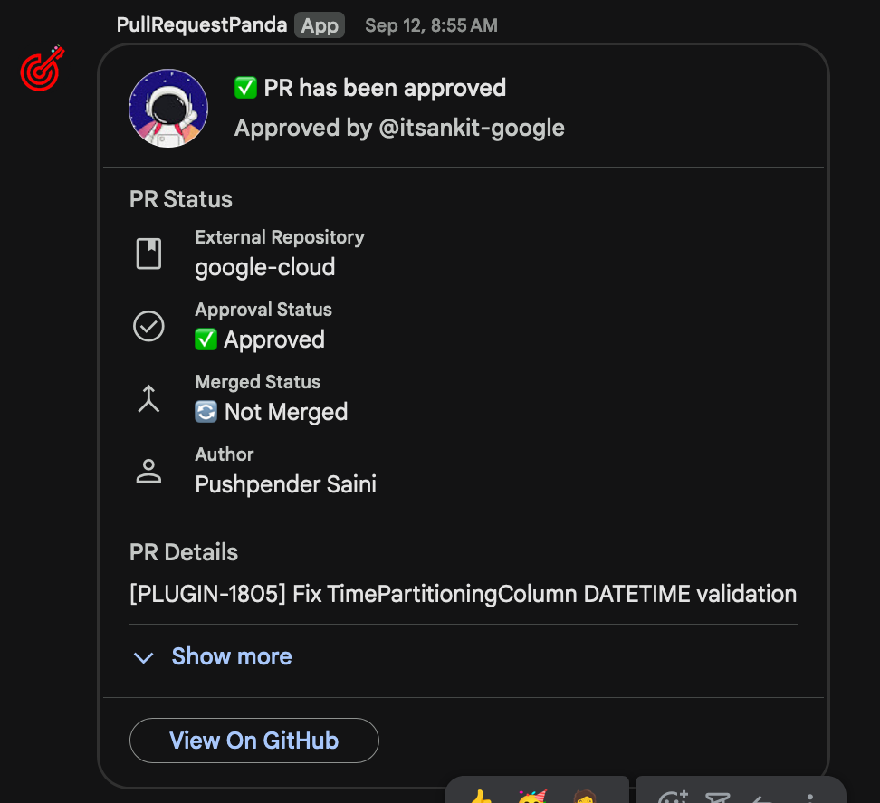

## Github Alert Bot

This is a simple bot that sends a message to a Google Chat room when some event happens in a Github repository.

### Demo Screenshots

|                Alert for a new PR raised                 |                   Alert for PR approval                    |
| :------------------------------------------------------: | :--------------------------------------------------------: |
|  |  |

### Run Unit Tests

```bash
git clone
cp .env.example .env
npm ci
npm run test
```

### Helpful links

- [CardV2 Docs](https://developers.google.com/workspace/chat/api/reference/rest/v1/cards)
- [Material Icons](https://fonts.google.com/icons?icon.size=24&icon.color=%23e8eaed&icon.platform=android)
- [Builder UI](https://addons.gsuite.google.com/uikit/builder)
- [CornGuru](https://crontab.guru/)
- [KV Namespaces Docs](https://developers.cloudflare.com/workers/wrangler/configuration/#kv-namespaces)
- [Workers Logs Docs](https://developers.cloudflare.com/workers/observability/logs/workers-logs/)
- [Localhost Trigger](http://localhost:41125/__scheduled?cron=*+*+*+*+*")
